## HuóNG DAN ON THI: Ic3 GS6 SParK LEveL 1

Nguòn tài lieu tham khao: IC3 Review, IIG Viet Nam.

Hoc sinh chú y: Dáp án dúng là dáu check màu xanh green, màu do là sai.

CHU DE 1 – TEST 1

Resources Question 1 of 15

## Máy tính dě bàn có thě sù dung loai thiět bi nào dě kět nǎi Internet?

Thiet bi Wifi

MOt thiět bi hien thi

Mòt thiět bi da phuong tièn

MOt thiet bi luu tru

Resources I Question 2 of 15

## Ban hāy cho biēt, hình ành nào sau dày là hình ành cùa mòt chiec Laptop?

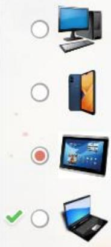

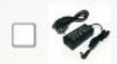

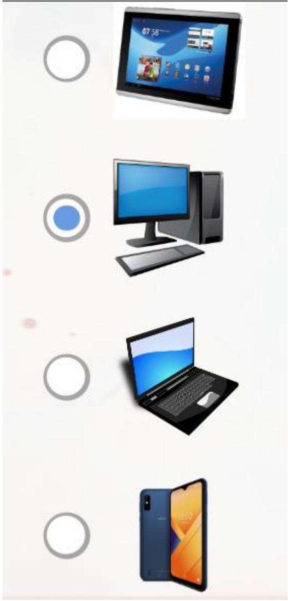

Resources Question 3 of 15

Ban hāy cho biět, hai thiět bi nào sau dày là thiēt bi ngoai vi? (Chon 2)

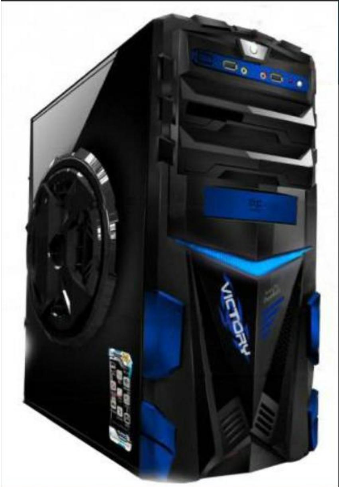

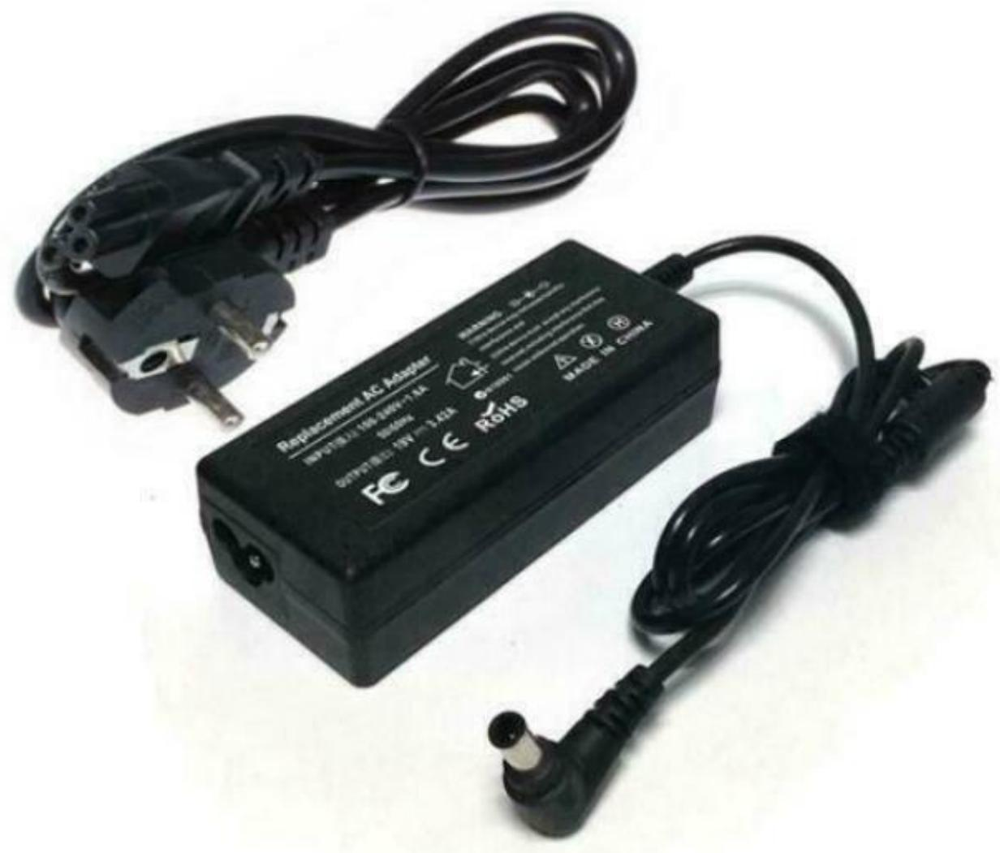

Resources Question 4 of15

## Ban can kět noi máy tính bàng voi Internet. Ban nèn su dung phuong tièn gì duái dày?

O Monitor Cable

O Printer Cable

Wifi

Bluetooth

Resources Question 5 of 15

## Ban hǎy cho biět, phǎn měm nào duái dày là phǎn měm úíng dung?

Microsoft Word

ios

Flash Drive

Windows

Resources I Question 6 of 15

## Ban hāy cho biět phǎn měm nào sau dày là hè diěu hành?

## Microsoft Windows

Apple iPad

Microsoft Word

Google

Resources Question 7 of 15

Ban dang hoc truc tuyěn tai thu vièn còng còng. Ban can sac Pin máy tính xách tay de hoàn thành còng vièc cúa mình. Màt nguòi la dang sac dièn thoai di dòng cúa ho o ô cám gän nhat. Ban nén làm gi đé vùa sac Pin máy tính và vüa tiěp tuc làm vièc?

Di chuyěn děn khu vuc có sän mòt o cǎm aě sac Pin máy tính và tiép tuc buòi hoc.

Hoc cho děn khi hět pin máy tính xách tay dě ban khòng làm phien bät cú ai.

Sù dung dày nōi dài kéo dài khǎp thu vièn dě ban khōng phài thay dōi chò ngòi.

Rút phích cǎm cúa diēn thoai di dōng de ban có thě sù dung o cǎm gàn dó.

Resources Question 8 of 15

An cän sac dièn thoai vào ban dèm dě có the su dung nó vào sáng hòm sau. Dàu là ndi an toàn dě An giü dièn thoai cua minh trong khi dang sac?

Duái göi nàm cùa An

O Trēn sàn nhà

O Trèn kè trong phòng tǎm

Tren bàn làm vièc cua An

Resources Question 9 of 15

## Thuàt ngǔ cho phan měm chay trèn dièn thoai hoǎc máy tính bàng là gì?

Widget

ApP

Program

●Icon

Resources Question 10 of 15

## Ban hāy cho biět, loai phan cúng (Hardware) nào gùi dü lièu dēn máy tính?

Xuat (Output)

Màn hình (Monitor)

Luu trǔ (Storage)

Nhap (Input)

Resources Question 11 of 15

## Di chuyěn tùng dinh nghia tù danh sách bèn trái sang thuàt ngü mà nó xác dinh o bèn phai.

the bhnca máytihancó

Thiet bi duoc phát minh cho mot muc dich cu the

3.Còng nghè di děn noi nguài dùng děn

4.Huóng dǎn mà máy tính làm theo

2.Thiet bi (Device)

Phan cúng "(Hardware)

Còng nghè di dòng 3 (Mobile)

4 (Program) Chuong trinh

Resources Question 12 of 15

## Ban hāy xác dinh mǒi muc hoǎc là phǎn cúíng hoǎc phàn měm. Chon cáu trà lòi o hòp bèn trái cho phù hgp vói tùng muc.

Phän měm (S... 目 Máy in (Printer)

Phan měm (.Co sa dü liu (Database)

Phän měm (S..  Chuot (Mouse)

Phän měm (S. 目 Ban phím (Keyboard)

Phan měm (S.Thu dièn tù (Email)

Resources Question 13of 15

## Ban muōn tìm mòt trò choi dudc cài dǎt trèn máy tính cùa minh. Trèn thanh tác vu dudc hiēn thi, ban nèn nhap vào dàu dē tìm trò choi?

Resources Question 14 of 15

## Hinh ành này cho biět loai thiět bi máy tính nào?

Máy tính xách tay (Laptop)

Diēn thoai thòng minh (Smartphone)

Máy tính dě bàn (Desktop)

Máy tính bang (Tablet)

Resources Question 15 of 15

## Thiet bi nào có bàn di chuòt tích hop dě trò và nhap?

Desktop

O Smartphone

Laptop

Tablet

CHU DE 1 - TEST 2

Resources Question 1 of 15

## Phát biēu nào sau dày là dúng vě mòt phǎn měm úng dung trèn máy tính đě bàn?

O Máy tính cùa ban phai dudc kět noi vái Internet de chay nó.

Phän měm khòng yèu cäu bàt ky dung luòng luu trǔ nào trèn máy tính cùa ban.

O Ban có thě dǎng nhàp vào nó tù bät ky thiět bi nào.

Phan měm phài duoc cài dǎt trèn máy tính cúa ban truóc khi ban có thě khài chay no.

Resources Question 2 of 15

Phuòng pháp nào sau dày duòc sú dung dě khòi dòng úíng dung dā cài dǎt trēn máy tính dē bàn? Chon Có něu dáp an dúng và khòng nēu dáp án sai.

Có Nhâp chuòt trái vào biēu tuong cúa chuong trinh tren Thanh tác vy (Taskbar).

Có Nhâp dúp chuòt vào bieu tuong löi tát cua

chuong trinh trèn màn hinh něn (Desktop).

có 目 Chon tat cà các bieu tudng löi tát trèn màn hinh

và nhan Enter trèn bàn phím.

Resources Question 3 of 15

## Döi voi mǒi phát biēu sau, hāy chon có něu phát biěu dó dúng và Khòng něu phát biēu dó sai.

có Máy tính dě bàn có thě di dòng duoc.

Có Dièn thoai thòng minh, máy tính bang và máy tính

xách tay có thě di dòng duoc.

Có Tai nghe (Headsets, Headphones), loa deu là thiet bi ngoai vi cho âm thanh (Sound/Audio).

Resources Question 4 of 15

Dièn thoai thòng minh có thě kět noi vói Internet bàng nhǔng cách nào? (Chon 2)

Wifi

USB

Ethernet

Gói dü lièu tù nhà cung cap dich vu di dng

Resources Question 5 of 15

Mòt sō cách dē thoát khòi úíng dung trèn máy tính dě bàn dā dudc cài dǎt là gì? chon có něu dáp án dúng và Khōng něu dáp án sai.

Có Nhap vào nút có dàu "x" ò góc phài trèn cùng cùa cúa sō.

Có 国Rút phích cǎm màn hình.

Có Nhap chuòt phài vào bieu tuong cùa chuong trinh

trèn thanh tác vu (Taskbar) và chon Close, Exit hoǎc Disable.

Resources I Question 6 of 15

## Thiět bi dau vào (Input Device) nào sau dày dudc tích hop vào dièn thoai thòng minh?

Tai nghe (Earbuds)

Bò sac pin (Charger)

Bàn di chuòt (Touchpad)

Màn hinh cam úng (Touchscreen)

Resources Question 7 of 15

## Kéo tùng thuàt ngü vào dinh nghia phù hgp. Dě trà lài, häy chuyěn tǔng thuàt ngü tù danh sách bèn phái sang dinh nghia cúa nó o bèn trái.

Ma có thě doc duoc bàng máy. Ma này bao gǒm các ò yuòng den và tráng, thuòng dùng dě luu trü các URL hoǎc các thòng tin khác.

vitrí ào de luu trǔ và sp xp các úng 'dung, tài lièu, dü lièu.

2.Thu muc (Folder)

1.Mä QR (QR Code)

3.Tap tin (File)

Resources Question 8 of 15

## Tùy chon nào sau dày là ví du vě thièt bi dàu vào dugc tích hop sān trèn máy tinh?

Màn hinh cam úng (Touchscreen)

Tai nghe (Headphones)

Chuòt (Mouse)

Resources Question 9 of 15

Ban cǎn sù' dung máy tính bang (Tablet) cúa mình trong giò hoc dè tham gia vào các bài hoc. Ban nhàn thày ràng thài luāng Pin cua máy tính bang dang tra nèn yěu. Bô sac cúa ban khòng hoat dòng. Ban nèn làm gì de tiëp' tuc tham gia trèn 'máy tính bàng cua mình?

O Bí mat chuyen döi bo sac vái ban bè trong già giài lao.

Hãy cho giáo viēn cúa ban biět ràng bò sac cúa ban khòng hoat dòng.

Hãy đē máy tính bàng cúa ban tǎt nguön và khòng tham gia vào bài hoc.

Buòc bò sac dièn thoai vào máy tiính bàng cùa ban ngay cà khi chúng khòng tuong thích. HG VIET NAM

Resources Question 11 of 15

## Tùy chon nào sau dày là nhǔǐng cách có thē sù' dung dě kět nōi máy tính bang voi Internet? (Chon 2)

sù dung kět noi Wifi còng còng.

Cǎm cáp Ethernet vào thiet bi và tuong.

sù dung gói dǔ liu tù nhà cung cap dich vu di dòng.

Resources Question 12 of 15

## Tùy chon nào sau dày là mòt tàp tin (File)?

Mòt thu' muc ành tù mòt chuyěn di thuc dia.

Tài lièu chúa danh sách bài tàp cǎn làm cùa ban.

Mot liēn kět dēn trang Web tru'òng hoc cúa ban.

Buoi phát truc tiēp su kiēn the thao.

Resources Question 13 of 15

## Máy tính dē bàn có thě sù dung loai thiět bi nào dē kět nǎi Internet?

Mot thiet bi luu trü (Storage Device)

MOt thiet bi Wifi (Wifi Device)

Mot thiet bi hien thi (Display Device)

Mòt thiet bi da phuong tièn (Media Device)

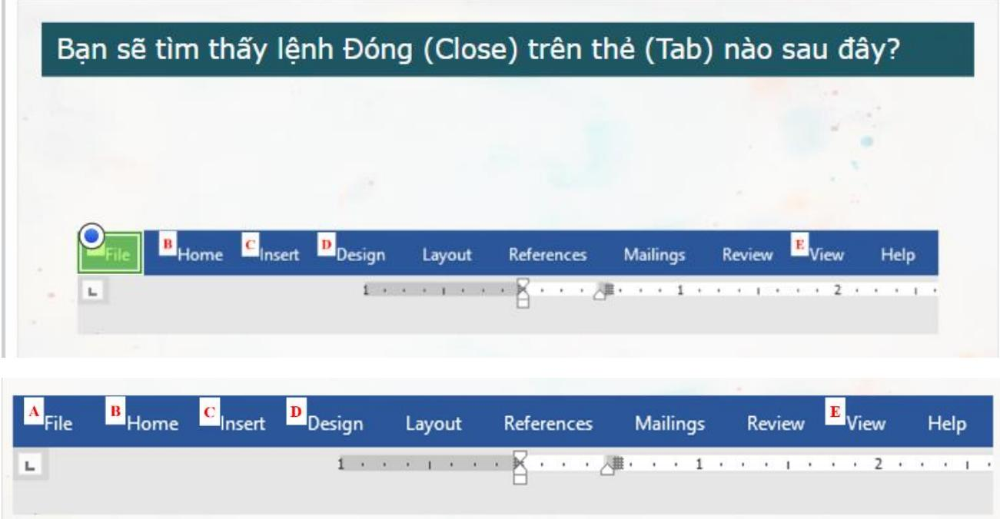

Resources Question 14 of 15

Ghép mǒi thuàt ngü vói dinh nghia dúng. Dě trà lài, hāy kéo thuat ngǔ' tù danh sách bèn phài sang dinh nghia cua nó ó bèn trái.

Phài duoc cài dǎt trèn máy tính truóc khi nó 'có thě chay.

2.Application

3.App

Phièn bàn nhe cúa úng dung phän měm thng uc hit e chy tren nhi so cǔng chay trèn máy tính xách tay.

1.Desktop Application

Resources | Question 15 of 15

# CHU DE 2 – TEST 1

Resources Question 1 of 16

## Quyěn rièng tu ky thuàt sǒ là gì?

O Che Camera trèn máy tính xách tay khi khòng sù dung.

Bào vè thòng tin dudc luu trü hoǎc chia sè truc tuyěn.

Trò thành ban bè tru'c tuyěn chi vói nhǔng nguòi ban bit trong the gioi thuc.

sú' dung màt khau phúc tap.

Resources Question 2 of 16

## Ban thay nhüng bình luàn ác y trong mòt cuòc trò chuyèn trong nhóm truc tuyěn. Mot cong dān tot cùa thǎi dai ky nguyèn sō, ban nēn nói gì?

Chúng ta chi nèn dǎng nhǔng bình luàn ác y trong mòt cuòc trò chuyèn rièng tu.

Ban có thě dǎng nhǔng bình luàn ác y něu nguài khác khòng nhìn thay chúng.

Bình luān ác y là khòng gày hai něu chúng bi xóa sau khi nhóm doc chúng.

Nhüng binh luàn này sě truc tuyěn mai mai.

Resources Question 3 of 16

## Trolling là gì?

co gǎng làm cho ai dó túc giàn bàng cách dǎng nhǔng diěu có y nghia vě ho.

co tình bò ai dó ra ngoài.

Dǎng nhàp vào trang cá nhàn cúa nguài khác và mao danh nguài đó.

Chia sé thòng tin cá nhàn vě ai dó mà khòng có su cho phép cùa ho.

Resources Question 4 of 16

## Tùy chon nào dai dièn cho mòt dǎc diēm cùa còng dàn ky thuàt sō tot?

sù' dung chü "Password" làm mat khau cho tat cà các tài khoàn cúa ban.

Già sù' moi thú ban dǎng sē dudc nguài khác nhìn thãy và chia sé.

O Lan truyěn tin dön trèn mang xã hoi.

● Chia sé vi trí cua ban trèn phuong tiēn truyěn thòng xā hài.

Resources Question 5 of 16

Ai dó dā đǎng mòt bình luàn xǎu tính trèn mang xā hòi vě ban An. Ban ây dā xóa bình luān, nhung cǔng chính nguài dó da viět nhüng binh luàn ác y hon. Mòt tèn goi cho nguài đā viět các binh luàn ác y là gì?

O M∂t Hacker (Hacker)

O Bát nat trèn mang (Cyberbully)

Màt ngudi mao danh - lüa dao (Catfish)

● Mot ké lüa dao (Scammer)

Resources Question 6 of 16

## Diěu nào sau dày là mòt phän cúa dàu ân ky thuàt sö (Digital Footprint) cua ban? (Chon 2)

Nhàn xét cùa ban vě bài dǎng trēn mang xā hòi cùa mòt nguài ban.

Email ban da gui.

Anh ban dā dǎng lèn mang xǎ hài.

Ho và tèn cùa ban.

## Ban dang trò chuyèn truc tuyěn vói mòt nguài ban và mòt cuòc tranh cai nay sinh. Ban nèn làm gì?

Tim bàng chúng de giành chiěn thǎng trong cuòc tranh luàn.

O Nhà mòt nguài ban khác hǒ tro ban.

Phót là ban bè cùa ban cho děn khi ho ngùng nói chuyèn.

Rdi khòi cuòc trò chuyèn.

Resources Question 8 of 16

## Tùy chon nào sau day là dúng? Chon Dúng něu dáp án dúng và sai nēu dáp án sai.

Dúng Truc tuyěn là mai mai.

Dúng  Ban có thě xóa vǐnh viěn các tin nhǎn dòc hai hoǎc

các bài dǎng trèn mang xā hòi khòi Internet.

Dúng Thòng tin cá nhàn nhu dia chì và sō dièn thoai

khòng nèn duoc dǎng truc tuyěn.

Dúng Ban nèn gùi tin nhǎn rièng cho ban cùng lóp bang

mat khau cùa minh trong truòng hop ban quèn mat khau.

Resources Question 9 of 16

## Ban nhàp tèn cua minh vào mòt còng cu tìm kiěm. Kět quà tim kiěm bao gǒm các ành mà ban dā xóa khòi trang Web ndi ban dā dǎng chúng. Diěu này có nghia là gì?

O Dü lièu còng cu tìm kiěm da khòng dudc càp nhàt gǎn day.

O Ban can làm mói trang kět quà tim kiem.

Thòng tin dugc dǎng truc tuyěn có the dudc sao chép hoǎc chia sé bài nhǔng nguòi khác.

● Chù sò hüu trang Web vǎn chua xóa xong ành.

Resources Question 10 of 16

## Ghép mǒi thuàt ngü vói dinh nghia dúng.

Cǒ y quày rǒi nguài khác bàng cách 1.dǎng truc tuyen binh luan xúc pham, khòng lién quan hoǎc có hai.

Múc do bào vě mà nguòi dùng có khi 2sù dung Internet, dǎc bièt là vě du lièu rièng tu hoǎc nhay cam.

2 Quyěn rièng tu (Privacy)

Mot nhóm nguòi giao tiěp bàng cách 3 su' dung Internet, thuòng là voi muc dich hoǎc mǒi quan tam chung.

Resources | Question 11 of 16

1.Trò dùa (Trolling)

Cōng dòng ky thuàt 3sö (Digital Community)

## Hành dòng nào là mòt ví dy vě bǎt nat trèn mang?

Dǎng tin nhǎn ác y vě ai dó trèn phuong tièn truyěn thòng xā hòi.

O Tao niěm vui cho mòt nguài ban cùng lóp vào giò ra choi.

Thích mòt bài dǎng trén phuong tièn truyěn thòng xā hòi cúa mòt' nguài ban cùng láp mà ban khòng biět.

Bi bò roi khòi cuòc trò chuyèn vào büa trua.

Resources I Question 12 of 16

## Mòt còng dàn kī thuàt sō tích cuc có thě làm gì?

Viet binh luàn tiéu cuc truc tuyěn.

Chia sé tèn, dia chi cùa moi nguài hoǎc dü lièu cá nhàn khác.

Báo cáo de doa tru'c tuyen (Cyberbullying).

## Doi vói mǒi phát bieu vě vièc dǎng thòng tin trèn Internet, ban hãy chon dáp án Dúng hoǎc sai cho mǒi phát biēu duói dày.

Dúng 三 sě khòng ai nhìn thày nòi dung ban dā dǎng

ngoai trù nhüng nguài theo dōi ban.

Dúng Xóa mòt hình ânh hoǎc Video khòi phuong tiēn

truyěn thòng xā hāi sē xóa nó vǐnh viěn.

Dúng Nhüng gi ban dǎng trèn Internet có the anh

huàng dēn nhǔng gì moi nguài nghì vě ban.

## Mòt còng dàn ky thuàt sō tièu cyc có thě làm gì?

viēt binh luān gày tōn thuong vě ai dó truc tuyěn.

Báo cáo de doa tru'c tuyěn cho mòt nguài lán.

Bào vè thòng tin nhay càm hoǎc thòng tin cá nhàn trong khi sù' dung Internet.

Resources Question 15 of16

## Dǎi vái mǒi phát biēu vě tuàng tác ky thuàt sō, hāy chon Dúng hoǎc Sai.

Dúng Thàt an toàn khi chia sé tèn day dù và vi trí cùa

ban vói ban bè truc tuyěn cùa ban.

Dúng Mòt cong dàn ky thuat so tot sě xin phép truóc

khi chia sé ành cùa nguài khác.

Dúng  Ban có thě dua ra nhǔng bình luàn ác y truc

tuyěn miěn là ban khòng nói chúng truc tiēp.

Resources Question 16 of 16

Khi ai dó sù dung còng nghè dě gày ác y vái nguài khác, vièc ho dang làm dudc goi là gi?

Là mòt nguài hành dòng

Trolling

Là mòt nguài ngoài cuòc

Bat nat tren mang (Cyberbullying)

CHU DE 3 – TEST 1

Resources Question 1 of 23

## Bàng cách sù' dung tiính nǎng Bookmarks/Favorites cúa trinh duyet Web, ban co thě luu gì?

O Hinh ânh trang Web (Webpage Images)

O Cookies trang Web (Webpage Cookies)

Cài dät trang Web (Webpage Settings)

Lièn kět trang Web (Webpage Links)

Resources Question 2 of 23

## Di chuyen tùng thuàt ngü tù danh sách bèn trái sang dinh nghia cùa nó ø bèn phài."

1 T

2Conc tim kiem (earch

3.Trang Web (Web Page)

Phän měm ban sù dung dě 2tim moi thu trèn Internet.

Phan měm ban sù dung dě 'xem moi thú' tren Internet.

Mot tài liéu vói vǎn bàn và 3hình ành'mà ban nhìn thǎy và doc trén Internet

Resources Question 3 of 23

## Ban dang tìm kiěm mòt noi dě di vói các ban cùng lóp. Ban doc mòt bài dánh giá truc tuyěn cho mòt nhà hàng nghe có vè tót. Ban khòng chǎc liéu có nēn tin vào tuyèn bò cúa nguài dánh giá hay khòng. Doi vói mǒi tuyèn bo, hay chon Thyc té hoǎc Y kiēn.

Y kiēn (Opinion)

Nhà hàng có mot khu trò choi diēn tù thyc su thú vi.

Y kiēn (Opinion)

Nhà hàng có các món tráng mièng ngon nhat.

Y kiēn (Opinion) 目

Nhà hàng chi cách truòng hoc màt däy nhà.

Y kiěn (Opinion) 目 Nhà hàng có muài loai Pizza khác nhau.

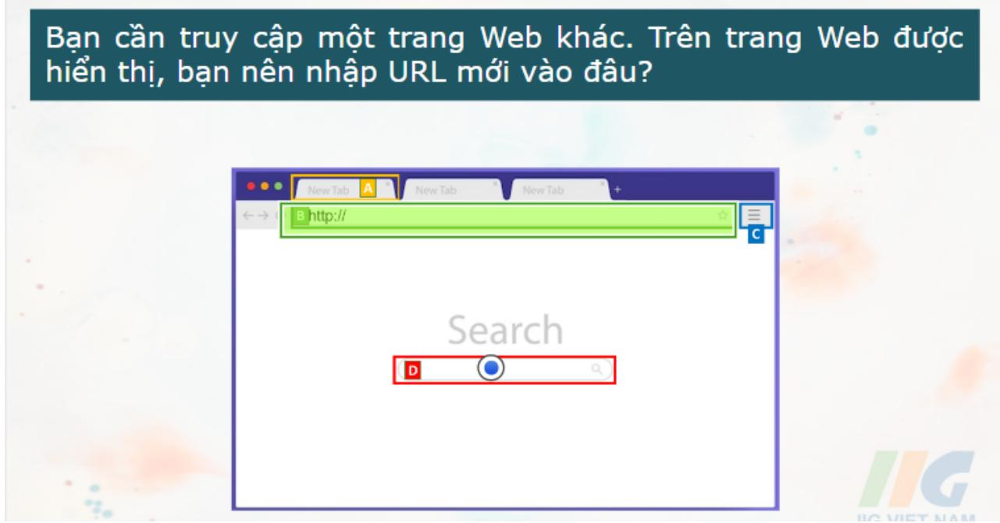

Resources  Question 4 of 23

## Vi du vě mòt úíng dung Web (Web Application) là gi?

Mòt trò choi dudc tài xuōng trēn máy tính de bàn.

Trang Web cua mòt truòng hoc.

MOt chuong trinh Email nhu Gmail, Yahoo, Hotmail.

Resources Question 5 of 23

## Ten cúa khu vuc ∂ däu cia so trinh duyèt hiēn thi URL trang Web duoc goi la gi?

O Thanh dia chi (Address Bar)

O Thanh tièu dě (Title Bar)

O Bookmarks/Favorites

Thè trinh duyèt (Tab)

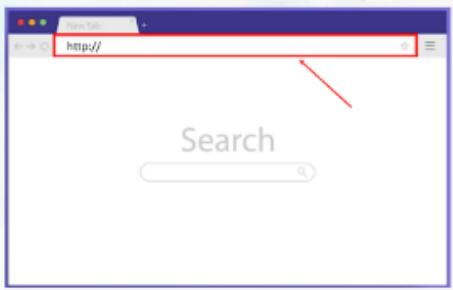

Resources Question 7 of 23

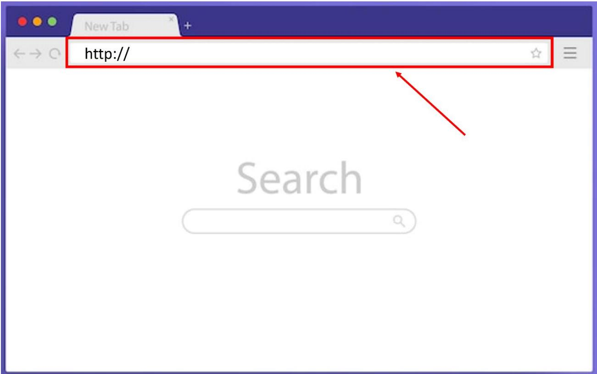

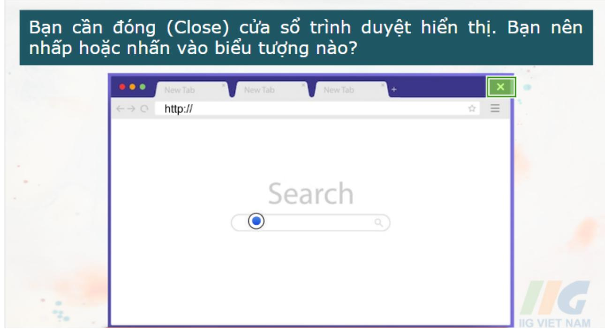

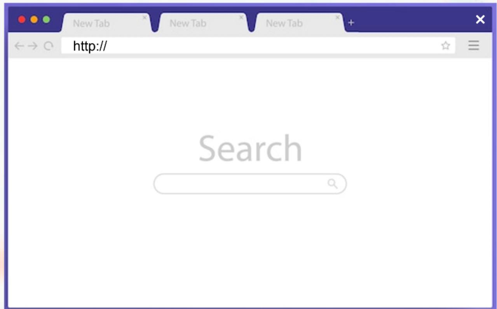

## Muc dich cùa vièc sùì dung dǎu trang/muc yèu thích (Bookmarks/Favorites) là gi?

Nó giúp vièc in URL cùa mòt trang Web trò nèn dě dàng

Dày là mòt cách nhanh chóng de luu URL và quay lai trang Web sau.

Dó là cách tot nhat dě chia sé URL vói ban cùng lóp hoǎc giáo vièn.

Resources Question 9 of 23

Mòt giáo vièn bào hoc sinh cua mình nghièn cúu mòt chù dě trèn máy tính bang cua ho trong 30 phút tiěp theo. Khi giáo viēn hòi mòt hoc sinh xem ban ǎy có thyc hiēn nghièn cúu hay khòng, ban ây nói có. Làm thě nào giáo viēn có the tìm ra lièu hoc sinh có nói su thàt hay khòng?

Bàng cách kiem tra thoi luong Pin còn lai cùa máy tính bàng.

Bàng cách kiēm tra xem có bat ky thé trinh duyèt nào duoc mò trèn máy tính bàng hay khòng.

Bàng cách hòi nhung hoc sinh khác ngǒi gän trong thòi gian nghièn cúu.

Bäng cách kiem tra lich su' trinh duyèt cúa hoc sinh.

Resources  Question 10 of 23

## Nhǔng thành phǎn nào sau dày thuòc giao dièn cùa trình duyèt Web? (Chon 3)

Cong cu tìm kiem (Search Engine)

Thé(Tab)

Các úng dung (Applications)

Cüa sδ (Window)

Thanh dia chi (Address Bar)

Tác già trang Web (Site Author)

Resources  Question 11 of 23

## URL là gì?

Mot trang Web hoǎc Email già dudc thiet kě tròng có vě dáng tin cày.

Tap hop các trang Web dudc lièn kět vái nhau sú'

dung chung mòt tèn miěn, mà moi nguòi có thě truy càp duoc.

Mòt hình thúc nhǎn tin giüa nguòi này vói nguài khác qua Internet.

Resources Question 12 of 23

## Tùy chon nào sau dày là ví dy vě mòt trang Web (Webpage)?

O Mòt Email giüa các hoc sinh a các truòng khác nhau.

Mòt úng dung dudc tài xuōng trèn diēn thoai thòng minh.

Trang chù trèn trang Web cúa truòng hoc.

Resources Question 13 of 23

## Ban có thě tìm thay URL cúa mòt trang Web o dàu dě có thě sao chép và dán?

Mòt cùa sō mói

Trong thanh dia chi.

Mòt Tab mói

Resources Question 14 of 23

## Ban thuòng tìm thǎy diěu gì trong uíng dung máy tính dě bàn và trén các trang Web?

Doan vǎn bàn

Giò hàng

Nút dǎt hàng

Thanh dia chì

Resources Question 15 of 23

## Ban hāy cho biět, tùy chon nào duói day cho phép truy cap và duyèt thong tin trèn Internet?

Cloud Storage (Luu trü dám may)

Client (Máy khách)

Server (Máy chù)

Internet Explorer

Resources  Question 16 of 23

Ban có thē sù dung thòng tin nào dē kiēm tra dà tin cày cùa mòt trang Web? (Chon 3)

Tác già (Author)

Tièu dě (Title)

□Cách trinh bày (Layout)

Ngày (Date)

Resources Question 17 of 23

Nhi thich doc các bài báo truc tuyěn. Co äy chi muōn doc các bài báo dua trèn su that, khòng phài y kiěn. Càu hòi nào có thě giúp Nhi xác dinh các bài báo dua trèn thuc tě?

Ai da viět bài báo?

O Kiēu phòng chǔ nào dā dudc sù' dung?

Bài viět có hình anh khòng?

Bài viet dài bao nhièu?

Resources Question 18 of 23

Trong cia so trinh duyèt duoc hiēn thi, ban nèn nhâp hoǎc nhàn vào dàu de truy càp các trang khác cua 'trang Web Net Pc?'

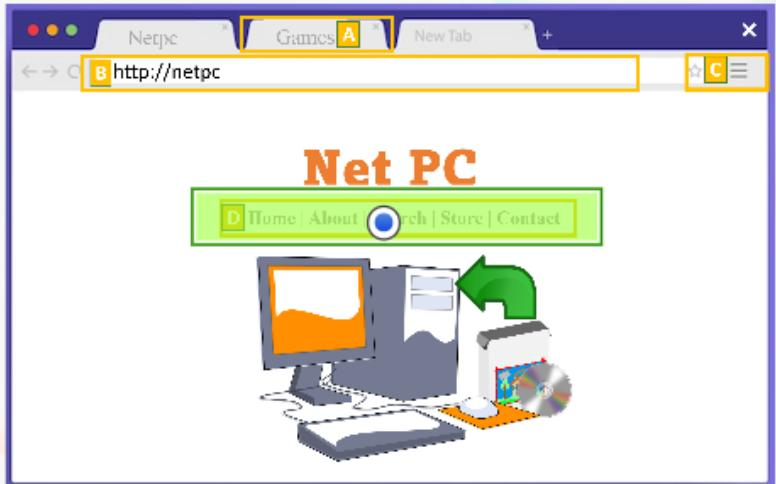

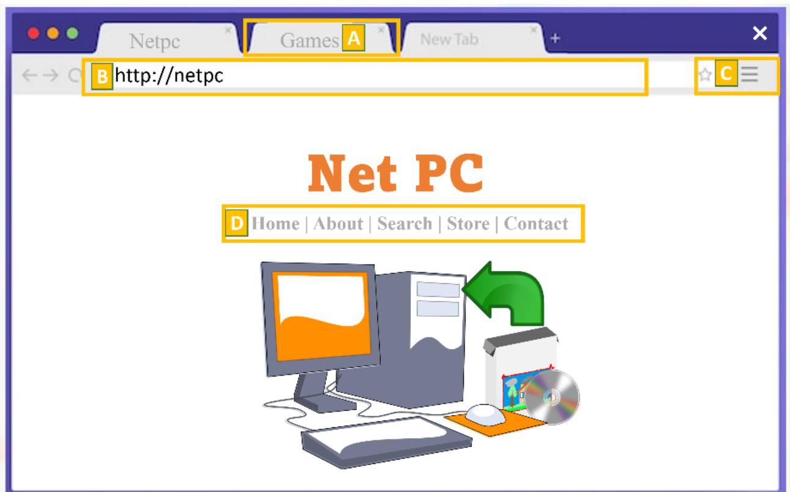

Resources Question 19 of 23

## Cách nhanh nhǎt dě luu mòt trang Web dě ban có thě quay lai trang dó sau này là gì?

O Chup ành màn hình cùa trang Web

Viet URL vào mòt cuön so

Tao dau trang (Bookmark)

Resources Question 20 of 23

## Ghép mǒi thuàt ngü vói dinh nghia dúng.

Tài lièu sièu vǎn bàn có thě dugc hien thi bang trinh duyèt Web.

Cong cu tìm kiěm '(Search Engine)

2.Thu thàp thòng tin vě mot chù dě.

Mot chuong trinh hoǎc phǎn měm Web

Resources Question 21 of 23

1.Trang Web (Web Page)

2.Nghien cuu (Research)

## Cách nhanh nhät dě luu trang Web ban dang xem dě ban có thě quay lai sau là gì?

O Tao dâu trang (Bookmark).

O Luu dia chi trang Web trong mot tàp tin.

O Luu trang Web vào màn hinh máy tính cùa ban.

● Viet dia chi trang Web trèn mot tò giãy.

Resources Question 22 of 23

## Ghép mǒi thuàt ngü vái dinh nghia dúng.

Mot chuong trinh phän měm duoc sù 1 dung de diěu huóng trèn World Wide Web.

1 Trinh duyèt (Web Browser)

Mot chuong trinh hoǎc phän měm 2duoc sù dung dě tim kiěm thòng tin, thuòng là trèn World Wide Web.

Tàp hop các trang Web có thě truy 3 càp còng khai và chia sé vói mòt tèn miën duy nhat.

3.Website

2 Cong cu tim kiěm (Search Engine)

Resources Question 23 of 23

## Ban hāy cho biět, còng cu nào cúa trinh duyèt cho phép truy càp vào các trang Web yēu thich?

Bookmarks

Settings

O Home

Back

CHU DE 4 – TEST 1

Resources Question 1 of 16

## Ban nèn sù' dung dinh dang nào dě hiēn thi, anh, bàn do và Video tù ky nghi hè cúa ban cho các ban trong lóp cua ban xem?

O M∂t áp phích (Poster)

O Mot tài lièu (Document)

O Mot bài trinh chieu (Slide Presentation)

● M∂t trang tính (Spreadsheet)

Resources Question 2 of 16

## Doi vói mǎi hành dòng, hāy chon có něu dó là ví du vě dinh dang vǎn bàn hoǎc khòng nēu khòng phài.

Có

In dàm vǎn bàn.

có

xóa mòt phǎn cúa doan vǎn bàn.

Thay doi kích co và màu sǎc cùa vǎn bàn.

Resources Question 3 of 16

## Em hāy cho biět, tō hop phím nào sau dày dudc sú' dung dě chon tat cà vǎn bàn trong cùng mòt tài liéu?

Alt +A

Tab + A

Shift + A

Ctrl + A

Resources Question 4 of 16

## Em hāy cho biět, tài lièu dièn tù có dǎc diēm gì?

Là nhǔng tài lièu da duàc in và phàn phoi.

Khòng có diěu nào ò trèn

Giúp bào vé mòi truòng bàng cách giàm lāng phí giãy.

Phài luòn luòn dudc in.

Resources Question 5 of 16

## Trong tình huōng nào thì mòt tài lièu (Document) sě hǔu ich hon mot ban trinh chieu (Presentation)?

Phát biéu truóc khán già.

viět mòt bài luàn cho truòng hoc.

Gùi tin nhǎn vǎn bàn cho mòt nhóm nguài.

Resources Question 6 of 16

## Ban dang tao mot áp phich trèn máy tính. Ban muon thay doi giao diēn cua cac chǔ cái và sō trong tièu dě áp phich. Ban nèn thay doi diěu gì?

Phòng chü (Font)

O Kich thuöc trang (Page Size)

O Dãn cách doan vǎn (Paragraph Spacing)

● Lě (Margin)

Resources Question 7 of 16

## Trong tình huōng nào sau dày là phù hop nhat dě sù dung bài trinh chieu ki thuat so (Digital Presentation)?

Gùi tin nhǎn vǎn bàn cho mòt nhóm nguài.

Viet mot bài luàn cho truòng hoc.

Phát biěu truóc khán già.

Resources Question 8 of 16

## Ban nèn nhǎn phím dǎc bièt nào trèn bàn phím tièu chuàn dě bat dau mòt doan moi trong tài lièu vǎn ban?

O Backspace/Delete

Enter/Return

O Caps Lock

Tab

EsC

Resources Question 9 of16

## Em hāy cho biět, dày là loai tàp tin gì?

Mòt trang Web (Web Page)

Mot trang tính (Spreadsheet)

Mot bài trinh chieu (Presentation)

Mot tài lièu (Document)

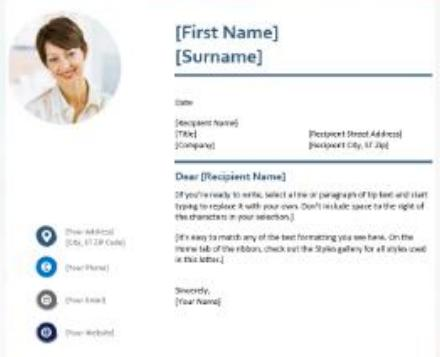

## Date

## [First Name] [Surname]

[Recipient Name] [Title] [Company]

[Recipient Street Address] [Recipient City, ST Zip]

## Dear [Recipient Name]

[Your Address] [City, ST ZIP Code]

[Your Phone]

[Your Email]

If you're ready to write, select a line or paragraph of tip text and start typing to replace it with your own. Don't include space to the right of the characters in your selection.]

[Your Website]

[It's easy to match any of the text formatting you see here. On the Home tab of the ribbon, check out the Styles gallery for all styles used in this letter.]

Resources Question 10 of 16

Sincerely, [Your Name]

Ban nèn sù dung úng dung nào dě hiēn thi ành, bàn do và Video tù ky nghi hè cùa minh cho các ban trong lóp hoc cúa ban xem?

Ap phich (Poster)

O Trang tính (Spreadsheet)

Bài trinh chieu (Slide Presentation)

● Tài lieu (Document)

Resources Question 11 of 16

## Hay ghép tùng thuàt ngǔ vói cách sù' dung thích hop.

M t phím trèn bàn phím dùng dě dua con 1 tr n u dngt heng hoat dòng.

Mt phím trèn bàn phím dùng dě di chuyěn 2.giüa các muc hoǎc di chuyen vě phía truóc 5 ky tu (tùy thuòc vào nhièm vu).

Mot phím trèn bàn phím dùng dě máy tính 'có thě nhàp các chǔ cái viět hoa lièn tuc.

Màt phím trèn bàn phím dùng dě xóa bat ky 4.ky tu nào truóc / sau vi trí hién tai cúa con tró.

M t phím ò trèn cùng bèn trái cua bàn phím 5.máy tính; cho phép nguài dùng hùy bò hoǎc dóng mòt hoat dòng.

2.Tab

5.ESC

1.Enter/Return

Resources Question 12 of 16

3.Caps Lock

4.Backspace/Delete

## Em hāy cho biět, cǎn sù dung phǎn měm úíng dung nào dě tao ra các chǔ cái tièu chuān thay vi sù dung máy dánh chū?

Màt úng dung bàng tính.

Mòt úng dung xù ly vǎn bàn.

O Màt úng dung CAD.

Mòt úng dung trinh chieu.

Resources Question 13 of 16

## Nhi muön tham gia mòt trang mang xǎ hòi mói noi tiěng. Dě dǎng ky, cò ay phài diēn vào mòt biēu māu truc tuyěn. Nhi nēn giü phím nào trong khi gō đe chi viět hoa chǔ cái däu tièn trong tèn cúa co äy?

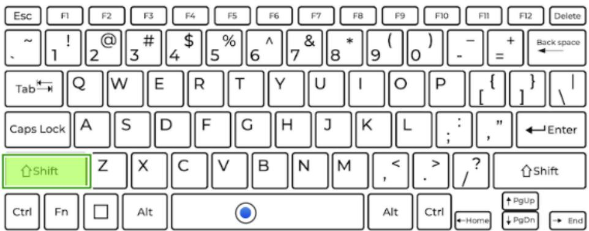

Resources Question 14 of 16

## Nhǔng thao tác nào sau dày, ban có thē thyc hièn vói tài lièu vǎn ban (Text Document)? (Chon 2)

Làm noi bàt (Highlight) vǎn bàn.

Thay doi mat khau (Password) Email cua ban.

Tǎng kích thuóc phòng chǔ (Font Size).

Resources Question 15 of 16

## Nhi dang viět mòt báo cáo trèn máy tính cua minh. Ban ãy dudc yèu cǎu thit lě dòng däu tiēn cúa mǎi doan mòt nuá Inch. Nhi nèn nhàn phím nào (mòt län) de thyt iě chính xác dòng däu tièn?

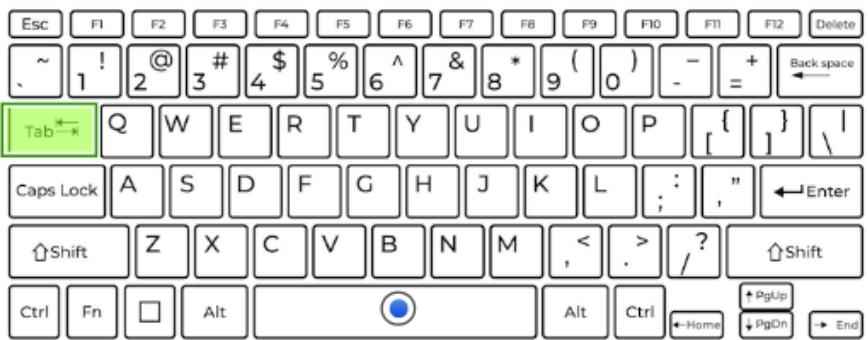

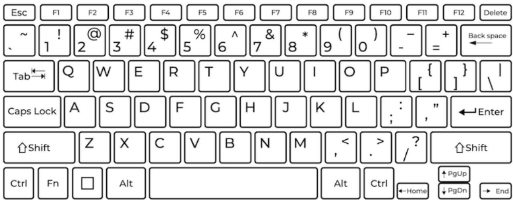

Resources Question 16 of 16

## Ghép mǒi thuàt ngü vái dinh nghia tuòng úíng.

Cách thòng tin sě dudc trong nhu thě nào trèn bàn 'in hoǎc hiēn thi trèn màn hình.

4 (Font) Phòng chǔ

Mot loai tàp tin dugc tao bài mot phan mem úng 'dung, có thě dugc thao tác bài úíng dung dó.

Hinh ành 5.(Image)

Trinh chiěu 3.(Presentation)

Mot tàp hop các ky tu kiēu chǔ hoǎc vǎn bàn có thě in 4.hoǎc hiēn thi dugc, xác dinh hinh dang, kích thuác và sy xuàt hièn cúa các chǔ' cái, sǒ và các ky ty dǎc biet.

Mot hinh anh hoǎc do hoa dugc luu trǔ duái dang diēn tù.

Dinh dang (Formatting)

Tài lièu 2(Document)

CHU DE 5 – TEST 1

Resources Question 1 of 20

## Noi mǒi tù vái dinh nghia thich hop.

Mot tin nhǎn dièn tù duoc gui qua 1Internet có the chua vǎn ban, tap tin, hình anh và tàp tin dinh kèm.

Tin nhǎn duoc gùi děn moi nguài khi 2ho dang truc tiēp hoat dong trong mòt ung dung.

Giao tiep truc dien, truc quan vi 3nhüng nguòi dùng Internet khác bàng Webcam.

Tin nhán trong úng 2.dung (In-app Message)

1.Thu diēn tùr (Email)

3 Trò chuyèn Video (Video Chat)

Resources Question 2 of 20

## Ban dang thuc hièn mòt du án nhóm vě dòng vàt. Ban cǎn gui hai búc ành và hai doan vě thàn làn cho ban cùng lóp cùa ban, nguài dang làm áp phích cho nhóm. Ban nèn gúi thòng tin cho ban cùng lóp cua minh nhu thě nào?

Güi bàng Email

Güi bàng tin nhǎn vǎn bàn

O Güi bàng cách dǎng trēn phuong tiēn truyěn thòng xǎ hài

Trò chuyēn Video

Resources Question 3 of 20

## Häu hět các thu và Email děu có ldi chào và lài kět thúc. Ban hāy lua chon cym tù trong danh sách phù hop vái các câu sau.

Cau kět thúc (….

Cau kět thúc (.…..

Nhüng löi chúc tot dep nhat (Best wishes),

Càu chào hòi (…

Càu chào hòi (…..

Tran trong (Sincerely yours),

Co An than měn (Dear miss An),

Xin chào (Good morning),

Resources Question 4 of 20

## Ghép mǒi thuàt ngü vái dinh nghia dúng.

Nguài nhan thu (dia chi Email 'ban nhap vào truòng To).

Dieu dau tièn dugc dgc trong mot cuòc giao tiěp, có thě khòng chinh huc oc trang trong ty thuòc vào doi tuong.

3N ch e ca mai bing mt

3.Dòng chù de (Subject Line)

1.Nguöi nhan (Recipient)

2.Löi chào (Greeting)

n ngip hu

4.N∂i dung thu (Message Body)

Resources Question 5 of 20

Giáo vièn cúa ban gùi mòt Email dě nhǎc nhò phu huynh ràng sě có mòt bài kiēm tra vào ngày mai. Ban muōn 'såp xěp màt budi hoc nhóm truóc khi đěn Iáp. Ban nhán tin cho mòt nguài ban, goi cho ngudi khác và trò chuyèn Video vói nguài ban thú ba dě sáp xěp thdi gian và dia diém hgc nhóm. Quy trinh nào dang dugc sú' dung dě gùi và nhàn thòng tin?

O Thdi gian sù' dung thiet bi (Screen Time)

O Cong tác (Collaboration)

O Truyěn thong ky thuat sö (Digital Communication)

● Bat nat tren mang (Cyberbullying)

Resources Question 6 of 20

Ban cua ban dā gùi mòt tin nhán dièn tù ngǎn tù dièn thoai cùa ban ây dēn dièn thoai cua ban. Tin nhán chúa các chǔ cái, sö và bieu tuong cám xúc. Ban cúa ban dā sú dung hinh thúc giao tiěp ky thuāt sǒ nào?

Goi dièn thoai

Tin nhǎn vǎn bàn

O Trò chuyèn Video

Thōng báo càp nhat

Resources Question 7 of 20

Nhi da xày dyng mòt mò hình lóp hoc cúa minh nhu mòt bài tàp vě nhà. Ban ày muǒn dua nó cho anh cúa ban ǎy, nguài söng ó xa. Ban ây muōn chì cho anh ây ndi ban ây ngǎi và nói vói anh ây vě giáo vièn cúa ban ây và ban bè cùa minh. Nhi nèn thě hièn và nói vái anh mình nhung diěu này nhu thě nào?

O Trong tin nhǎn vǎn bàn.

O Trong cuòc trò chuyèn Video.

O Trong mòt bài dǎng trèn mang xā hài.

● Trong thòng diep Email.

Resources Question 8 of 20

## Lòi chào nào duói dày sě thích hop nhat khi hoc sinh gùi Email cho nguài ban thàn nhat cùa ho?

Thua giáo su, (Dear Professor,)

Chào! Thě nào roi? (Hey! How's it going?)

Có phài là Xuàn khòng? (Is this Xuan?)

Resources Question 9 of 20

## Hinh thúc giao tiēp ky thuàt sō hièu quà nhǎt dē lièn hè vǎi bò phàn hō tro khách hàng và dět càu hòi là gì?

Hòi nghi truyěn hinh (Video Conferencing)

Viet mot búc thu (Write A Letter)

Trò chuyèn truc tiěp (Live Chat)

Resources Question 10 of 20

Tùy chon nào sau dày là nhüng thành phän cd ban cúa thu dièn tú? Chon Có něu là thành phan có trong thu dièn túù và Khòng něu khòng phài.

Khòng

Chù đě (Subject)

Khòng Nài dung thu (Message Body)

Khòng

Chü ky (Signature)

Khòng

Mat khäu (Passwords)

Khòng

Ma QR (QR Codes)

Resources Question 11 of 20

## Ban dang nói chuyèn vái ban bè trèn thiět bi ky thuàt so cùa minh. Vói sy trd giúp cua 'Camera tích hop, ban có the chú dòng nhìn thay ban bè cúa mình và ban bè cúa ban có thě nhìn thày ban. Ban và ban bè cúa ban dang sú' dung hình thúc giao tiěp ky thuàt sö nào?

O Goi diēn thoai (Phone Call)

Trò chuyèn Video (Video Chat)

O Tin nhǎn vǎn ban (Text Message)

● Güi thu dièn tù (Email)

Resources Question 12 of 20

## Mòt sǒ ví du vě truyěn thòng ky thuàt sō (Digital Communication) là gi? (Chon 2)

Trò chuyèn video (Video Chat)

Thu dièn tù (Email)

Thu viět tay dudc gùi qua duòng buu dièn

Resources Question 13 of 20

Ban là dòi truòng cua dài bóng dá. Ban can thay mǎt dòi bóng hói huàn luyèn vièn cua minh mòt cáu hói khan cap. Ban nèn dät URGEnT a dàu de dam bao ràng huân luyèn vièn cúa ban nhàn dugc thòng báo và mò Email màt cách nhanh chóng?

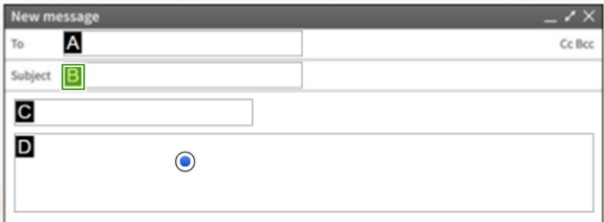

New message

To

A

CcBcc

Subject B

Resources Question 14 of20

Lài chào nào sau dày sē thich hop nhat khi hoc sinh gùi Email cho giáo vièn/giàng vièn?

Chào! Thě nào röi? (Hey! How's it going?)

O Khi nào nhièm vu děn han?

Thua giáo su, (Dear Professor,)

Resources Question 15 of 20

Nhi dang gǎp ban mình sau già hoc dě hoc nhóm. Vào cuǎi giò hoc, giáo vién cúa Nhi yèu cäu ban ày ā lai vài phút dě giúp don dep bàn hoc. Nhi sē đěn muòn de gǎp ban mình. Cách nhanh nhät de Nhi nói vói ban minh ràng ban ây sē děn muòn vài phút là gì?

O Trò chuyèn Video (Video Chat)

O Güi tin nhǎn vǎn ban (Text Message)

Güi Email

Dǎng trèn phuong tièn truyěn thōng xã hòi (Post On Social Media)

Resources Question 16 of 20

Rian dang gúi cho cò mot Email. Ban äy biět có nǎm phan quan trong can dua Email. Em hāy cho biět lài chào là vi trí nào?

Exercise 5

A Dung.tt@school.com

B Exercise 5

C. Dear Ms. Dung,

I would like to submit my exercise.

Exercise 5

A Dung.tt@school.com

\$B Exercise 5

Dear Ms. Dung.

D I would like to submit my exercise.

Thanks, Riarl

Sans Serif

Resources Question 17 of 20

## Hǎy ghép nōi vói tùng phuong pháp giao tiēp ki thuàt sǒ vói tinh huōng thích hop nhat.

1Gui lich da sua doi cho tat cà moi 'nguòi trong dòi diěn kinh.

e  n Te

Thngbáo cho anbè rng ban

ienhevib han tro truc

1.Thu dien tuù (Email)

Resources Question 18 of 20

Ban hāy cho biět, diěu gì sau dày là mòt loi thě cùa vièc sù dung Email thay vi tin nhǎn túc thòi?

Hǒ tro bieu tuong cam xúc (Emoticons).

Có the chong lai Virus.

Nguài nhàn khòng can phài Online ngay lúc Email duoc gùi.

Có thě dính kèm hinh ành.

Resources Question 19 of 20

Ban cǎn gùi mòt Email cho giáo vièn cùa ban. Ban nèn dǎt dia chi Email cúa giáo vièn ö dàu?

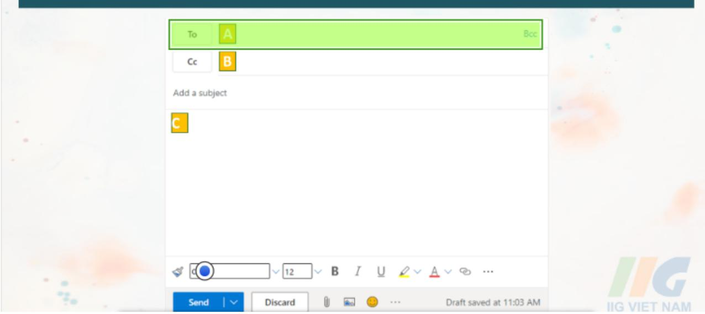

To

Bcc

B

Cc

Add a subject

Calibri

|12

SendI

Discard

Draft saved at 11:03 AM

Resources Question 20of 20

An cǎn gùi Email càm on děn giáo vièn cùa mình nhung ban ǎy khòng biēt nèn sù dung phòng chū nào. Phòng chū nào thich hop nhat cho thòng báo này?

Dear Mus Dang

rear Miss sung

DEAR MISS DUNG

Dear Miss Dung

## DEAR MISS DUNG

Dear Miss Dung   
Dear Miss Dung   
Dear Miss Dung   
DEAR MISS DUNG   
Dear Miss Dung   
Dear Miss Dung   
Dear Miss Dung

# CHU DE 6 – TEST 1

Resources  Question 1 of 15

## Dǎi vái mǒi phát biēu vě vièc vàn chuyěn máy tính xách tay, hāy chon Dúng hoǎc Sai.

Dúng Máy tính xách tay có the duoc giü trong xe mòt cách an toàn.

Dúng Máy tính xách tay duoc vàn chuyěn an toàn trong túi dung máy tính xách tay.

Dúng Máy tính xách tay có thē bi hòng něu tiěp xúc vái nhièt dò khác nghièt.

Resources  Question 2 of 15

## Phan thòng tin nào là an toàn dē chia sé truc tuyěn?

Màu sǎc yèu thích cùa ban.

Dia diēm yèu thich cúa ban.

Tèn truòng cúa ban.

Còng vièn ua thích cúa ban.

Resources Question 3 of 15

## Khi nào thì có thě nói chuyèn vói nguài la truc tuyěn?

Khòng bao già

Bat cú lúc nào

Ban ngày

Cuöi tuan

Resources Question 4 of 15

## Ban nhàn duoc mòt Email tù ci'a hàng yèu thich cúa mình nói ràng ban da giành dugc 1000 Dò-la. Ban có thě nhàp thòng tin cua minh vào bieu mǎu truc tuyěn dě nhàn tiěn. Diěu gi sě khiěn ban quan tàm vě Email này?

Cua hàng có thě da nhǎm lǎn vì ban khòng nhó đa tham gia cuòc thi.

Tiěn ò dang thé quà tǎng chì có thě dugc sù dung tai mòt dia diēm.

Cua hàng có thě muön ban tham gia vào mòt chiěn dich quàng cáo.

Email có thě là tù mòt ké lùa dào dang cǒ gǎng thu thàp thòng tin cá nhàn cùa ban.

Resources I Question 5 of 15

## Ban nèn làm gì něu ban bi nguài la có hành vi truc tuyěn khòng phù hop?

Yèu cǎu nguài la dùng hành vi.

Nói vái cha me hoǎc giáo vièn cùa ban.

Trò chuyèn vói nguài la dě giü ho truc tuyěn.

Nói vói nguài la ràng ban khòng thích hành vi cúa ho.

Resources I Question 6 of 15

Ban dang truy càp Internet và cùa so hiěn thi bèn duoi bàt lèn. Ban cǎn quyět dinh nhung gì ban có the làm mòt cách an toàn. Dǎi vói mōi hành dòng, hay chon có něu ban nèn làm diěu dó hoǎc Khòng něu ban khòng nèn làm diěu dó.

Cick here to Get Mora Frae GamesiHI

Create Account

Khòng Nhàp dia chi Email và màt khau thòng thuòng cùa ban.

Khòng Döng y vói các Diěu khoàn và Diěu kièn.

Khong  Nhp vào Get More Free Games! de nhan them

Game miěn phí.

## Hãy xem xét nhǔng ban biět vě bàn chǎt còng khai và làu dài cùa nòi dung truc tuyěn. Nài dung nào KHònG an toàn de chia se truc tuyēn?

O Màt búc ành vě bua toi ngon mièng cua ban.

O Vi trí GPs cúa còng vièn bèn canh ngòi nhà cúa ban.

Mòt búc ânh vě du án nghè thuat hoàn toàn tuyèt vài cùa ban.

● Danh sách nhüng cuōn sách yèu thích cùa ban.

Resources Question 8 of 15

Doi vái mòi màt khau, hāy chon Manh něu màt khau manh hoǎc yěu něu màt khau yěu.

Yěu

W3\*ud28x

Yěu

1234567890

Yěu

ILoveC@ndy2

Resources Question 9 of 15

## Hoc sinh mói can tao mòt trang Web vói mat khau là orange mà truòng hoc cúa ban sù dung đe quàn ly bài tàp vě nhà. Ho yèu cäu ban cung càp' các meo màt khàu. Ban nèn' nói gì vói ho?

O Tao māt khäu ngǎn de dě nhó.

O sù dung sō và ky hièu trong māt khäu.

sù dung tèn thú cung cúa ho làm mat khau.

Chia sé mât khäu vói ban trong truòng hop ho quèn nó.

Resources Question 10 of 15

Thuàt ngǔ cho thòi gian ban dành dě làm nhǔng vièc nhu:   
Xem mòt chuong trinh truyěn hinh vói gia dinh cua ban. Chdi trò chdi diēn tú trèn bang diěu khiēn. Güi tin nhán vǎn ban tù dièn thoai thòng minh.   
Nghièn cúu mòt cái gì dó trèn máy tính.

O Thài gian sù dung thiet bi (Screen Time).

O Tuong tác truc tuyen (Online Interaction).

O Thdi gian tàp trung (Focus Time).

● Can bàng truyěn thòng (Media Balance).

Resources Question 11 of 15

## Thòng tin cá nhan nào ban KHònG nèn chia sé tru'c tuyěn?

Tèn

Dia chi

Lóp

Tuoi

Resources Question 12 of 15

## Ban có màt máy tính, mòt màn hinh và mot bàn phím trong phòng cùa ban. Tai sao ban nèn che bàn phim khi ban khòng sú dung nó?

Dě bào vè bàn phím khòi nhièt dà lanh.

Dě bào vè bàn phím khòi bui.

O Dě bào vè bàn phím khòi ánh sáng mǎt trài.

Dě bào vè bàn phím khòi nhièt dà àm áp.

Resources Question 13 of 15

## Nhóm nào thích hop cho ban bè truc tuyěn?

O Nhüng ngudi ban biet trong cuòc sōng thuc.

Nhǔng ngui ban gǎp khi choi trò choi truc tuyěn.

● Nhǔng nguài thuc hiēn giao hàng děn nhà ban.

Resources  Question 14 of 15

Lung me ban dau khi bà ngǒi vào bàn làm vièc dē sù dung máy tính. Me yèu cǎu ban cho lài khuyèn vě cách có tu thě tot. Ban nèn nói gì vái me?

Bǎt chéo chàn và ngà nguòi ra sau.

Nang màn hình máy tính lèn trén tam mǎt de phài nguóc nhìn lèn nó.

Ngoi thǎng lung và chàn phǎng trèn sàn nhà.

Nghiēng vě phía màn hình máy tính.

Resources Question 15 of 15

Ai dó ban gǎp truc tuyěn, yèu cäu ban cung càp tèn và dia chi cua ban dē ho güi cho ban lài mài du tièc sinh nhàt. Ban nēn làm gì?

Cung càp tèn và dia chi cùa ban.

Cung cǎp tèn cúa ban nhung khòng cho biět dia ch cùa ban.

O Tù choi cung cap tèn hoǎc dia chì cùa ban.

● Dě nghi gǎp ho tai büa tièc.

# CHU DE 6 - TEST 2

Resources  Question 1 of 16

## Càn bàng phuong tién (Media Balance) là gi?

sù' dung phuòng tièn de càm thay khòe manh và càn bang voi các hoat dòng sōng khác.

Bàn trinh chiěu sù dung kēt hop hình ành, vǎn bàn và âm thanh.

Dành tat cà thòi gian rành trén dién thoai thòng minh cùa ban.

Resources I Question 2 of 16

## Cách nào sau dày là an toàn nhat dě sac thiět bi di dòng?

Dǎt ò noi an toàn gǎn o cǎm và cǎm cáp sac di kèm vói thiet bi.

Dǎt thiět bi di dòng bèn ngoài trong ngày và sac nó duái ánh nǎng truc tiēp.

Dǎt thiet bi trèn sàn và cǎm cáp sac cùa mòt thiet bi khác.

Resources Question 3 of 16

## Ban gùi anh cùa ban và gia dinh cúa ban cho mòt nguài ban cùng lóp. Ban cùng lóp đǎng ánh lèn mang xā hòi cua ho. Ban

Güi yèu cǎu hǒ tro đěn dich vu khách hàng cùa úng dung truyěn thōng xā hōi.

Ban khōng thě xóa ành māi mai, vi Internet là còng khai và vǐnh viěn.

Dōt nhàp vào máy tính cùa ban cùng lóp và co gǎng xóa các búc ành.

Bào ban cùng lóp cùa ban gā ành xuōng něu khòng ban sě khòng còn là ban cúa ho nǔa.

Resources Question 4 of 16

## Tùy chon nào sau dày là phù hop yói còng thái hoc? Chon có něu dáp án dúng và khòng něu dáp án sai.

Khòng Giü chan trèn sàn.

Khòng Cúi nguài vě phía truóc dě xem màn hinh.

Khòng Bät chéo chan duói bàn làm vièc.

Khòng Thu giān vai cùa ban.

Resources Question 5 of 16

## Tùy chon nào sau dày là phù hop giúp bào màt ki thuàt sǒ? chon có nēu dáp án dúng và khōng nēu dáp án sai.

Khòng  Khòng chia sé màt khàu vói nguòi khác.

Khòng Luu trü mat khau trèn máy tính.

Khòng  sùr dung mòt màt khau khác nhau cho mǒi tài

khoàn.

Khòng Nói cho ai dó biět màt khàu cùa ban dē ho cǔng có

the sù' dung chúng.

Resources Question 6 of 16

## Vi trí nào sau dày là ndi tot nhat dē sac Pin dièn thoai thòng minh?

Trēn sàn nhà bàng cách sù dung bò sac cùa nguài la.

Duói chǎn cùa mòt chiěc giuòng.

Trèn bě mǎt phǎng, noi khòng có thúc ǎn, chat lòng hoǎc nhièt dò quá cao.

Resources Question 7 of 16

Ban nhàn duoc Email tù mòt nguòi gùi khòng xác dinh nói ràng ban dā giành duoc giài thuòng và yèu cǎu ban trà lài kèm theo tèn, dia chi và sö diēn thoai cua ban. Diěu an toàn nhat de làm tiěp theo là gi?

O Trà lài nguài gùi vài thòng tin dudc yèu cǎu.

Trà lài nguài gùi bàng mòt tin nhǎn yèu cǎu thēm thòng tin.

Nói vái mòt nguài lón ràng ban dā nhàn dudc mòt Email giōng nhu' mòt trò lùa dào.

Resources Question 8 of 16

## Ghép mǒi thuàt ngü vài dinh nghia dúng.

Vi trí và cách chúng ta giü dau, cǒ, 1.lung và còt sōng khi dung, ngǒi hoǎc nàm.

Thòng tin có thě duàc sù dung dě 2.xác dinh mòt nguài, chǎng han nhu dia chì duòng pho và sǒ dièn'thoai.

Mot chuǒi ky tu duoc sù dung dě 3.xác minh danh tính cúa nguòi dùng trong quá trinh xác thyc.

1.Tu thě (Posture)

Các hoat dàng dugc thuc hièn truóc 'màn hinh, nhu Tv' hoǎc máy tính.

Dü liéu cá nhân (Personal 2 Data)

3.Mat khau (Password)

4.Screen Time

Resources Question 9 of 16

## Mat khau an toàn là gì?

O Mat khau mà mòt nguài ban dā cung cap cho ban.

Màt khàu bao gǒm tat cà các so và chǔ cái.

Màt khàu khó doán bài con nguài hoǎc máy tính.

Resources Question 10 of 16

Ban gǎp mot ngudi trong phòng trò chuyèn chdi Game tryc tuyěn. Ho yèu cǎu ban cung càp dia chi nhà cua ban. Ban nèn kět luàn diěu gì tù yèu cäu cua ho?

O Ho muön děn thǎm ban.

O Ho muōn gui cho ban mòt cái gì aó.

O Ho tò mò vě ndi ban sōng.

Ho khòng phai là mot nguài ban truc tuyěn thích hop.

Resources Question 11 of 16

## Bat nat truc tuyěn (Cyberbullying) là gì?

Gui tin nhǎn cho nhǔng nguài ban vùa gǎp.

Cung cap thòng tin cá nhàn cúa ban cho mòt nguài la truc tuyěn.

sù dung còng nghè dē quày roi, de doa hoǎc khiēn nguài khác xǎu hō.

Resources Question 12 of 16

## Tùy chon nào sau dày là phù hop đě trò thành mòt nguòi ban tru'c tuyěn?

Mòt nguài mà ban di hoc vói nguài dó và choi trò chdi truc tuyěn vào cuöi tuän.

Ai dó güi Email cho ban nói ràng ban dǎ giành dudc giài thuàng và cǎn gui lai thòng tin cá nhàn.

Mot nguài la gui tin nhǎn tryc tiěp trèn mang xǎ hòi yèu cǎu sō diēn thoai cùa ban.

Resources Question 13 of16

## ví du vě mòt nguài ban truc tuyěn thích hop là gì?

Mot nguòi noi tieng trén Internet, nhu Vlogger hoǎc danh nhàn.

Mòt nguài ban cùng láp mà ban di hoc cùng vái nguài ban dó và choi trò choi truc tuyěn vào cuòi tuan.

Ai dó gùi tin nhǎn trong úng dung yèu cǎu ban chia sé thòng tin cá nhàn vě bàn thàn.

Resources Question 14 of16

## Thòng tin nào KHONG nèn dudc chia sé truc tuyěn? (Chon 3)

Tuδi (Age)

Ngày sinh (Birthdate)

Dia chi nhà (Home Address)

Bài hát em yèu thich (Favourite Song)

Resources  Question 15 of 16

## Nhǔng yěu tō nào sau dày làm cho thiět bi có thě bi hòng? (Chon 3)

Ngón tay (Fingers)

Co vé sinh

Mua (Rain)

Thuc pham (Food)

## Diěu nào sau dày có thě làm hòng máy tính xách tay? (Chon 2)

Di chuyěn máy tính xách tay bang cách xách màn hình.

Dě máy tính xách tay trong xe quá nóng hoǎc quá lanh.

sù dung túi dung máy tính xách tay có dēm vói dày deo dē giǔ cǒ dinh máy tính xách tay.

## CHU DE Mo RoNG – TEsT 1

Resources Question 1 of 13

## Ban dang nghièn cúu tryc tuyěn cho mòt bài tàp vě dai duong. Giáo vièn cúa ban da huóng dǎn ban bao gǒm it nhàt ba sy kiēn và khòng có y kiēn. Tùy chon nào sau day là mòt y kiěn?

O Cá sōng trong dai duong.

Dai duong toi tǎm và dáng so.

Dai duong luòn chuyěn dòng.

Nhieu loai dōng vàt song trong dai duong.

Resources Question 2 of 13

## Cong tác (Collaboration) Ià gì?

Khi moi nguài làm vièc vói nhau de hoàn thành mòt nhièm vu.

Làm vièc trèn máy tính hàng tuǎn.

Canh tranh cho diem tot nhat trong lóp.

Resources  Question 3 of 13

## Doi vói mǒi phát biēu vě muc tièu còng tác, ban hāy chon Dúng hoǎc Sai.

Dúng Hoc sinh hoc hòi tù y tuàng cúa nguài khác.

Dúng Hoc sinh hoc cách giao tiěp vái nguài khác.

Dúng Hoc sinh hoc dudc rang cách tot nhat de làm

vièc là làm viéc mòt minh.

Resources Question 4 of 13

## Muc tièu là gì?

Thòng tin an toàn dě chia sé tru'c tuyěn.

Mòt thuc tě da dudc chúng minh.

Thòng tin mà ban cho là dúng su thàt.

Mòt kět quà mà ban muōn dat duoc.

Resources  Question 5 of 13

## Nhǔng ví du nào duói dày là các y kiěn? Chon có hoǎc Khòng cho mòi vi du.

Khòng

Có 24 già trong mòt ngày.

Khōng

Khòng

That là mòt ngày tuyèt vài.

Resources Question 6 of 13

## Muc dich cua su còng tác (Collaboration) là gìi?

Làm viéc vói nhǔng nguài khác dē huóng tói mòt muc tièu chung.

Tro thành hoc sinh nhanh nhat trong lóp.

Làm viēc chǎm chi hon các hoc sinh khác trong láp.

Làm vièc mòt minh de hoàn thành nhièm vu.

Resources I Question 7 of 13

## Hoat dòng nào là mòt ví dy vě su hop tác?

Än trua trong nhà ǎn.

Làm vièc trong mòt du án nhóm vái các ban cùng lóp.

O chay mòt cuòc dua dě dánh bai thoi gian tot nhat cùa ban.

Làm bài kiem tra trong lóp hoc cúa ban.

Resources Question 8 of.13

## Tùy chon nào sau day là mot thành phǎn quan trong cúa còng tác kǐ thuat so (Digital Collaboration)?

có ai dó trong nhóm nói cho moi nguài biět phài làm gì.

Biět nhieu hon bat cú ai khác trong nhóm.

Dǎt muc tièu mà tat cà các thành vièn trong nhóm děu hieu.

Resources Question 9 of 13

## Tùy chon nào duói dày khòng phài là muc tièu cua su còng tác? (Chon 2)

Làm vièc cùng nhau de dat du'oc mòt kět quà chung.

Giü kín y tuòng và kiěn thúc rièng cùa moi nguài.

chia sé y tuòng và kiěn thúc.

Thuyět phuc moi nguài dong y vai y kiěn cùa ban.

Resources I Question 10 of 13

## Muc tiéu cúa su còng tác (Collaboration) là gì? Chon có hoǎc Khòng.

Chia sé y tuòng và kiěn thúc.

Làm viéc cng nhau de dat duoc mot kět quà chung.

có Thuyět phuc moi nguài dong y vói y kiěn cùa ban.

Có Giü kín y tuòng và kiěn thúc cùa ban.

Resources| Question 11 of 13

## Trong các ví du sau, ví du nào là nhǔǐng ví du vě su thàt (Facts)? Chon có hoǎc Khòng cho mōi ví du da cho bèn duái.

Có 24 giò trong mòt ngày.

Nhày dù rat nguy hiem.

That là mòt ngày tuyèt vài.

Resources Question 12 of 13

## Ban và hai nguài ban cùng lóp dang làm vièc cùng nhau trong màt du án. Nhiēm vu cúa ban là tao ra màt áp phích vǎi thòng tin vě cá mâp. Ban sě in ra nhüng búc ânh cua cá màp. Mòt nguài ban sě mua bang áp phích và diēm dánh dàu và nguài kia sě iãp ráp áp phích.

O Dě thyc hièn còng vièc nhanh nhat có the.

Dě in gon gàng trèn bàng áp phích.

O Dě hòa hop vái tu cách là màt nhóm.

Dě tao áp phích vái thòng tin vě cá māp.